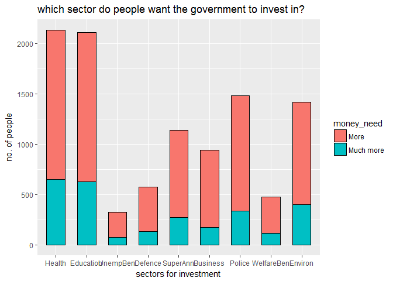
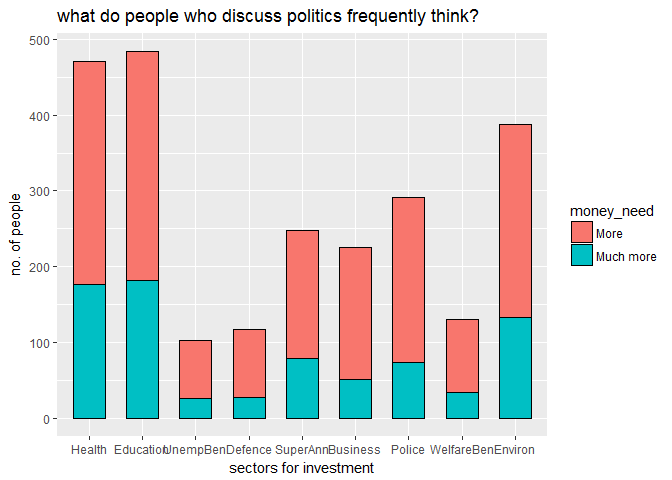

Statement 1:
------------

As statement 1 for analysis I created graphs to observe the trend
followed by public opinion regarding the sectors where they feel that
the government should invest more money.

    library(tidyr)

    ## Warning: package 'tidyr' was built under R version 3.3.3

    library(ggplot2)

    ## Warning: package 'ggplot2' was built under R version 3.3.3

    library(dplyr)

    ## Warning: package 'dplyr' was built under R version 3.3.3

    ## 
    ## Attaching package: 'dplyr'

    ## The following objects are masked from 'package:stats':
    ## 
    ##     filter, lag

    ## The following objects are masked from 'package:base':
    ## 
    ##     intersect, setdiff, setequal, union

    load("selected_nzes2011.Rdata")

    selected_nzes2011$ID <- seq.int(nrow(selected_nzes2011))

    selected_nzes2011$ID<- factor(selected_nzes2011$ID)

    moneyOpinionColumns <- selected_nzes2011[, c("ID", "jsphealth", "jspedu", "jspunemp", "jspdefence", "jspsuper", "jspbusind", "jsppolice", "jspwelfare", "jspenviro")]

    data_long <- gather(moneyOpinionColumns, department, money_need, jsphealth:jspenviro, factor_key=TRUE)

    data_long <- data_long %>% filter(money_need == "More" | money_need == "Much more")

    data_long$department<- factor(data_long$department)
    data_long$money_need<- factor(data_long$money_need)

    levels(data_long$department) <- c("Health", "Education", "UnempBen", "Defence", "SuperAnn", "Business", "Police", "WelfareBen","Environ")

    ggplot(data =data_long, aes(x = department, fill = money_need))+geom_bar(colour = "black", stat = "count",width = 0.6)+xlab("sectors for investment")+ylab("no. of people")+ggtitle("which sector do people want the government to invest in?")

    selected_nzes2011$ID <- seq.int(nrow(selected_nzes2011))
    selected_nzes2011$ID<- factor(selected_nzes2011$ID)

    FrequentDiscussPeople <- selected_nzes2011 %>% filter(jdiscussp == "Yes, frequently")

    moneyOpinionColumns <- FrequentDiscussPeople[, c("ID", "jsphealth", "jspedu", "jspunemp", "jspdefence", "jspsuper", "jspbusind", "jsppolice", "jspwelfare", "jspenviro")]

    data_long <- gather(moneyOpinionColumns, department, money_need, jsphealth:jspenviro, factor_key=TRUE)

    data_long <- data_long %>% filter(money_need == "More" | money_need == "Much more")

    data_long$department<- factor(data_long$department)
    data_long$money_need<- factor(data_long$money_need)

    levels(data_long$department) <- c("Health", "Education", "UnempBen", "Defence", "SuperAnn", "Business", "Police", "WelfareBen","Environ")

    ggplot(data =data_long, aes(x = department, fill = money_need))+geom_bar(colour = "black", stat = "count",width = 0.6)+xlab("sectors for investment")+ylab("no. of people")+ggtitle("what do people who discuss politics frequently think?")

