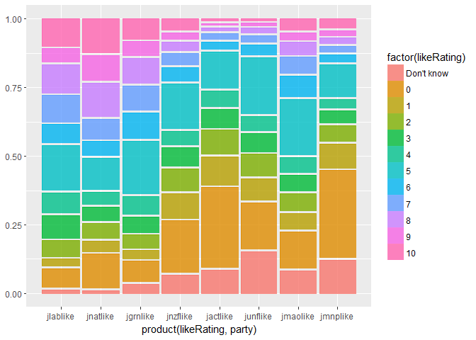

    library(ggplot2)

    ## Warning: package 'ggplot2' was built under R version 3.3.3

    library(dplyr)

    ## Warning: package 'dplyr' was built under R version 3.3.3

    ## 
    ## Attaching package: 'dplyr'

    ## The following objects are masked from 'package:stats':
    ## 
    ##     filter, lag

    ## The following objects are masked from 'package:base':
    ## 
    ##     intersect, setdiff, setequal, union

    library(ggmosaic)

    ## Warning: package 'ggmosaic' was built under R version 3.3.3

    ## Loading required package: productplots

    ## Warning: package 'productplots' was built under R version 3.3.3

    ## 
    ## Attaching package: 'ggmosaic'

    ## The following objects are masked from 'package:productplots':
    ## 
    ##     ddecker, hspine, mosaic, prodcalc, spine, vspine

    library(tidyr)

    ## Warning: package 'tidyr' was built under R version 3.3.3

    load("selected_nzes2011.Rdata")

    selected_nzes2011$ID <- seq.int(nrow(selected_nzes2011))

    selected_nzes2011$ID<- factor(selected_nzes2011$ID)

    likeOpinionColumns <- selected_nzes2011[, c("ID", "jlablike","jnatlike", "jgrnlike","jnzflike", "jactlike", "junflike", "jmaolike", "jmnplike")]

    like_data_long <- gather(likeOpinionColumns, party, likeRating, jlablike:jmnplike, factor_key=TRUE)

    like_data_long <- like_data_long %>% filter(!is.na(likeRating), likeRating != "NA")

    like_data_long$party<- factor(like_data_long$party)
    #like_data_long$likeRating<- factor(like_data_long$likeRating)
    like_data_long$likeRating<- factor(like_data_long$likeRating, ordered=TRUE, levels = c("Don't know", "0", "1", "2", "3", "4", "5", "6", "7", "8", "9", "10"))
    levels(like_data_long$likeRating)

    ##  [1] "Don't know" "0"          "1"          "2"          "3"         
    ##  [6] "4"          "5"          "6"          "7"          "8"         
    ## [11] "9"          "10"

    #like_data_long
    ggplot(data = like_data_long) + geom_mosaic(aes(weight = 1, x = product(likeRating, party), fill = factor(likeRating)),na.rm = TRUE)

